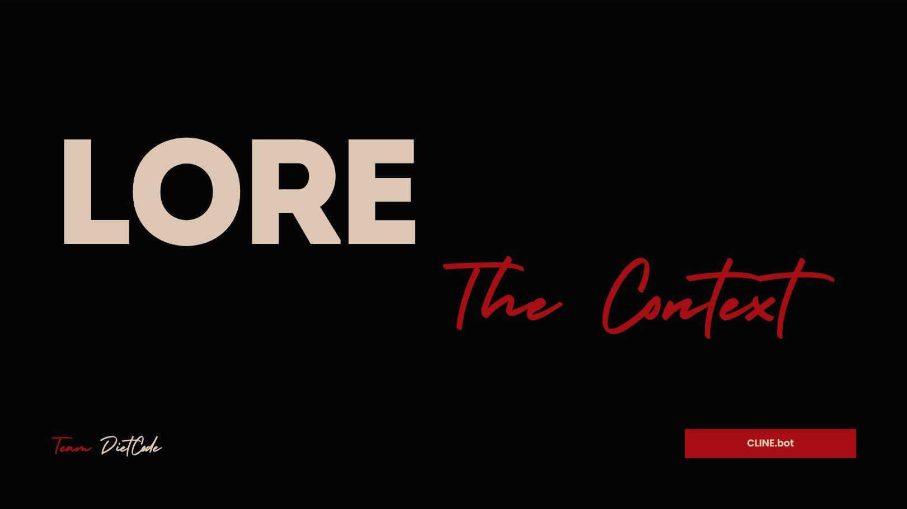
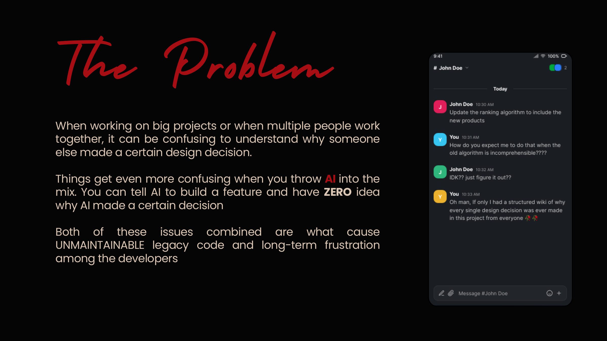
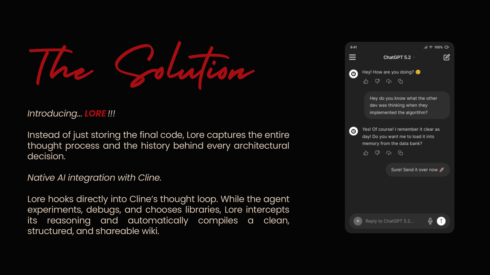
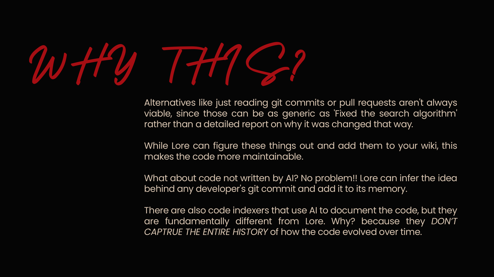
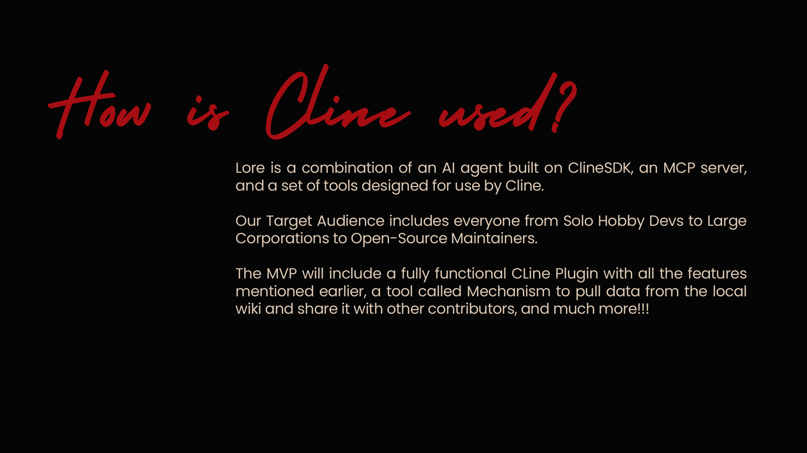

<div align="center">




### *Git records what changed. Lore records why.*

**A local architectural knowledge engine — it captures the *reasoning* behind your code,
whether that code was written by an AI agent or a human, and keeps it inside the repository,
next to the code it explains.**


`npm run setup` · `npm run demo` · `lore query why-did-we-do-this`

</div>

---

*The full pitch — [`concept/proposal.pdf`](concept/proposal.pdf):*

<p align="center">
  
  
</p>
<p align="center">
  
  
</p>

<details><summary>📖 Pitch transcript (text version of the slides)</summary>

> ### The Black Box Problem
>
> AI coding agents like **Cline** generate code at incredible speed — but their intermediate
> reasoning, the trade-offs they weighed, the libraries they *rejected*... all of it evaporates
> the moment the task ends. Human commit messages don't save you either: **"fix search"** tells
> you nothing five years later.
>
> Both of these issues combined are what cause **unmaintainable legacy code** and long-term
> frustration among developers.
>
> ### The Solution — Lore
>
> Instead of just storing the final code, Lore captures the **entire thought process** behind
> every architectural decision. It hooks directly into Cline's thought loop — while the agent
> experiments, debugs, and chooses libraries, Lore intercepts its reasoning and automatically
> compiles a clean, structured, **shareable wiki**. And for code not written by AI? No problem —
> Lore infers the rationale behind *any* developer's git commit and adds it to its memory.
>
> Alternatives like just reading git commits or PRs aren't always viable — they can be as generic
> as *"Fixed the search algorithm"* rather than a detailed report on why it was changed. Code
> indexers that use AI to document code are fundamentally different too: they **don't capture the
> entire history** of how the code evolved over time.

</details>

*(from the pitch — [`concept/proposal.pdf`](concept/proposal.pdf))*

---

## 🧭 Table of Contents

1. [The problem → the fix (30 seconds)](#-the-problem--the-fix-30-seconds)
2. [Quickstart on a brand-new system (dumb-proof)](#-quickstart-on-a-brand-new-system)
3. [The 60-second demo](#-the-60-second-demo)
4. [Use it on *this* repository as a living demo](#-use-it-on-this-repository-as-a-living-demo)
5. [Using Lore with the Cline CLI](#-using-lore-with-the-cline-cli)
6. [Using Lore in your own repository](#-using-lore-in-your-own-repository)
7. [Every feature, one by one](#-every-feature-one-by-one)
8. [How it works](#-how-it-works)
9. [🤖 For AI models & agents (deep instructions)](#-for-ai-models--agents-deep-instructions)
10. [Command reference](#-command-reference)
11. [Troubleshooting (when it breaks, look here)](#-troubleshooting)
12. [Status & scaling](#-status--where-it-scales)

---

## 🎯 The problem → the fix (30 seconds)

| | Git gives you | Lore gives you |
|---|---|---|
| **What changed** | ✅ the diff | ✅ the diff |
| **Why it changed** | ❌ `fix search` | ✅ *context, decision, alternatives rejected, consequences* |
| **Agent's reasoning** | ❌ gone forever | ✅ captured live from Cline's thought loop |
| **Human's rationale** | ❌ commit message at best | ✅ inferred from the commit + diff |
| **Shared with the team** | ✅ | ✅ curated ADRs are committed; raw evidence stays local |

The knowledge lives in a single `.lore/` folder **inside the repository** — versioned with the code,
mergeable between maintainers, searchable, and exposed to any MCP client.

---

## 🚀 Quickstart on a brand-new system

> **Zero assumptions.** Copy-paste each block in order. If a step fails, jump to
> [Troubleshooting](#-troubleshooting) — every known failure has a one-line fix there.

### Step 0 — Prerequisites (one-time, machine level)

You need exactly two things:

```bash
# 1) Node.js 22 or newer — Lore needs node:sqlite (FTS5), recursive fs.watch, node:test
node -v          # must print v22.x or higher
#    not installed? → https://nodejs.org  (or: nvm install 22)

# 2) git — any recent version
git --version
```

That's it. **You do NOT need an API key, a Cline account, or any paid service.**
Everything below works fully offline in *fixture mode*. The [Cline CLI](#-using-lore-with-the-cline-cli)
is optional and only adds *live* model inference + live agent capture.

### Step 1 — Clone and install dependencies

```bash
git clone https://github.com/Bittu5134/Lore.git
cd Lore

npm install      # ← REQUIRED. Installs the npm workspace: @lore/core, @lore/cli,
                 #    @lore/plugin, @lore/mcp. Nothing works without this step.
```

> ⚠️ **Do not skip `npm install`.** On a fresh clone, `lore`, the tests, the demo and even
> `npm run setup` all depend on the workspace links and the local `tsx` binary that it creates.

### Step 2 — One-command setup (checks and fixes everything)

```bash
npm run setup
```

This single command validates your machine and installs everything:

```
Lore setup
  ok    Node 26.10.0
  ok    dependencies installed
  ok    tsx works
  ok    cline installed (not authenticated - `cline auth` for live model)
  ok    capture plugin installed in Cline

running tests...
  ok    test suite passes (all 36 tests green)

All good. Try Lore:
  npm run demo           # offline demo (no model key needed)
  npm run demo -- --live # real model calls via Cline
```

What it checks, in order: **①** Node ≥ 22 → **②** deps installed → **③** `tsx` actually runs
(npm sometimes blocks esbuild's postinstall) → **④** Cline CLI present/authenticated *(skipped
gracefully if absent)* → **⑤** installs the Lore capture plugin into Cline (clearing stale plugin
caches) → **⑥** runs all 36 tests + type-checks every package.

Any `FAIL` line comes with the exact command to fix it.

### Step 3 — Put `lore` on your PATH (recommended, once)

```bash
npm link ./packages/cli     # creates a global `lore` command
lore --help                 # verify
```

> No global link? Every command in this README also works as
> `npx --yes tsx packages/cli/src/index.ts <cmd>` from inside the repo.

### Step 4 — Done. You now have a working Lore.

```bash
lore doctor     # full installation health check — everything should be ok/warn
npm run demo    # see it in action (next section)
```

---

## 🎬 The 60-second demo

```bash
npm run demo                 # fully offline: fixtures, no API keys, no typing
npm run demo -- --live       # same demo, but a real Cline run (needs `cline auth`)
```

One command. It narrates itself and builds a throwaway playground in `/tmp/lore-demo`:

| Beat | What happens |
|---|---|
| **1 · one command sets everything up** | `lore init` → knowledge store, git hooks, agent rule |
| **2 · an agent (or a human) does real work** | a Cline session is captured live (or seeded offline) |
| **3 · the decision writes itself** | the session ends → Lore compiles an ADR **on its own** |
| **4 · this is what Lore captured** | context, decision, **the alternatives that were REJECTED and why** |
| **5 · humans too — zero AI involved** | a hand-made commit is documented by the git hook |
| **6 · the decision graph** | an HTML graph: nodes = ADRs, edges = supersedes + shared tags |

Full walkthrough: **[docs/demo.md](docs/demo.md)**.

---

## 🏠 Use it on *this* repository as a living demo

**You don't need a project of your own.** This repo runs Lore on itself — `.lore/wiki/` already
contains **26 real ADRs** written while Lore was being built, including supersession chains
(a decision later retired by a better one). Clone is demo:

```bash
lore status                  # the dashboard: 26 accepted ADRs, hooks, capture stats
lore query config            # FTS search: "why is config done this way?"
lore query "raw evidence"
lore graph                   # → .lore/wiki/graph.html — open it in a browser
lore digest --limit 10       # markdown digest of recent decisions (paste into a PR)
lore audit                   # secrets scan across evidence + wiki (exit 1 = findings)
lore review --all            # triage low-confidence drafts → accepted wiki
lore rollup --month 2026-10  # synthesise a theme ADR for a period (dry run; add --write)
lore share --out bundle.json # export the wiki as a portable bundle for a teammate
lore doctor                  # verify this installation end to end
```

Then use the repo as a real **Cline playground**:

```bash
cline                              # interactive Cline session in this repo
cline -p "explain ADR-0002"        # the agent reads .clinerules/lore.md (continuity rule)
                                   # and answers using the wiki
cline mcp                          # the lore MCP server is already registered
```

Ask the agent in-session: *"search_lore for why the MCP server is hand-rolled"* — it will call
the `search_lore` tool, read the ADR, and answer with the actual reasoning (ADR-0005, later
superseded by ADR-0012 when the official SDK was adopted — a real supersession chain you can
inspect with `lore query supersede`).

---

## 🔌 Using Lore with the Cline CLI

Lore integrates with Cline in **four ways**. `lore init` does a & b per repo;
`npm run setup` does c; `cline auth` unlocks d.

### a. Capture plugin — agent reasoning → evidence

The plugin (`packages/plugin`) hooks into Cline's runtime via `@cline/sdk`:

- `hooks.onEvent` streams **live reasoning deltas**, tool calls/results and run completions
  into `.lore/raw/*.jsonl` — the append-only evidence store. Static analyzers and git diffs
  can *never* see this layer.
- `setup()` injects the **continuity rule**: every session starts knowing what was decided
  here (`.clinerules/lore.md` — *"read the wiki before you edit; supersede explicitly"*).
- It **auto-registers the Lore MCP server** with Cline.

```bash
cline plugin install ./packages/plugin    # or just: npm run setup
cline plugin list                         # verify
```

<details><summary>Plugin edits not taking effect? (stale cache)</summary>

`cline plugin install --force` reuses Cline's cached directory and does **not** overwrite files:

```bash
cline plugin uninstall lore && cline plugin install ./packages/plugin
```
</details>

### b. Git hooks — human commits → evidence

`lore init` sets `git core.hooksPath=.lore/hooks`:

- **`post-commit`** → runs `lore sync`: every commit (AI or human) becomes ADR evidence
- **`post-merge`** → runs `lore reconcile`: divergent wiki edits from two machines are both
  preserved and renumbered — **the wiki itself merges**

### c. MCP server — search + record from any client

```bash
lore mcp --install      # registers the server in ~/.cline/mcp.json (auto-approves read tools)
lore mcp                # or run the stdio server manually
```

| Tool | Purpose |
|---|---|
| `search_lore` | Search the wiki of ADRs — call before changing code |
| `get_adr` | Read one ADR by id (`ADR-0001`) |
| `record_decision` | Record a decision the agent just made |

<details><summary>Manual registration — <code>~/.cline/mcp.json</code></summary>

```json
{
  "mcpServers": {
    "lore": {
      "command": "npx",
      "args": ["--yes", "tsx", "/abs/path/to/Lore/packages/mcp/src/index.ts"],
      "env": { "LORE_ROOT": "/abs/path/to/your/repo" },
      "autoApprove": ["search_lore", "get_adr"]
    }
  }
}
```

Verify with `cline config mcp --json`. Works in the Cline CLI, the Cline VS Code extension,
and any other MCP client.
</details>

### d. Live inference — the ADR writer

Lore compiles evidence into ADRs by shelling out to the **local, authenticated Cline CLI**
(`cline -p`) — reusing your existing Cline auth, no extra API keys:

```bash
cline auth        # once per machine, if not already authenticated
```

No auth / offline? Use fixture mode anywhere: `lore compile --fixture`.

---

## 📦 Using Lore in your own repository

```bash
cd your-repo
lore init                 # creates .lore/, installs hooks, writes .clinerules/lore.md
# ...just work normally. Cline sessions are captured by the plugin, commits are
# documented by the hook, and decisions are written automatically when a run ends.
lore query <words>        # ask why something is the way it is
```

**That's the whole product — on a normal day you run nothing.** Read the results in
`.lore/wiki/` (`index.md` lists every decision). Have an old repo with years of history?
`lore backfill [--full]` documents existing history in batches.

---

## ✨ Every feature, one by one

| # | Feature | Command | What you get |
|---|---|---|---|
| 1 | **Status dashboard** | `lore status` | accepted ADRs, drafts, hooks, capture stats |
| 2 | **FTS search** | `lore query <words>` | SQLite FTS5 search across the wiki |
| 3 | **Cross-repo search** | `lore link add <path>` + `query --all` | search linked repos together |
| 4 | **Decision graph** | `lore graph` | self-contained HTML graph (supersedes + shared tags) |
| 5 | **Digest** | `lore digest [--limit N]` | markdown summary for PRs / release notes |
| 6 | **Secrets audit** | `lore audit` | CI-safe scan of evidence + wiki (exit 1 on findings) |
| 7 | **Draft review** | `lore review [id\|--all]` | promote low-confidence drafts into the wiki |
| 8 | **Supersession** | `lore supersede <id> --by <id>` | retire a decision citing its replacement |
| 9 | **Theme rollups** | `lore rollup [--month YYYY-MM]` | summarise a period into a theme ADR |
| 10 | **History backfill** | `lore backfill [--full]` | document an existing repo's past |
| 11 | **Session watcher** | `lore watch` | capture the human edit journey between commits |
| 12 | **Portability** | `lore share` / `lore pull` | export/import the wiki as a bundle |
| 13 | **Merge reconcile** | `lore reconcile` | both sides of divergent wiki edits preserved |
| 14 | **MCP server** | `lore mcp` | `search_lore` / `get_adr` / `record_decision` for any client |
| 15 | **Health check** | `lore doctor` | verifies everything, prints the fix per problem |
| 16 | **Offline mode** | `--fixture` | deterministic, no model call, no auth — CI-friendly |

---

## ⚙️ How it works

```
.lore/
  config.json   autonomy, confidence threshold, inference settings, ignores
  hooks/        post-commit + post-merge  (activated via git core.hooksPath)
  raw/          append-only evidence: agent events, commits, edit sessions  (LOCAL, git-ignored)
  wiki/         the knowledge: ADR-NNNN-*.md + index.md                     (committed, shared)
  drafts/       low-confidence ADRs awaiting review                        (committed)
  meta/         bookkeeping: cursor state, queue
```

| Part | Role |
|---|---|
| `lore` CLI | the 21 commands below |
| Cline plugin | `onEvent` → `raw/`; injects the decision index as a rule; registers the MCP server |
| Git hooks | `post-commit` → `lore sync`; `post-merge` → `lore reconcile` |
| MCP server | stdio JSON-RPC — works in any MCP client |

**Autonomy**: results with confidence ≥ `config.confidenceThreshold` (default 0.60) are written
straight to `wiki/`; anything less goes to `drafts/` for review. Raw evidence is local;
the curated ADRs are committed and shared.

npm workspaces + TypeScript (run through `tsx`, no build step). Frozen interfaces live in
`packages/core/src/types.ts` (`CONTRACTS_VERSION`); each package has a `SPEC.md`.

| Package | Responsibility |
|---|---|
| `packages/core` | store, event log, ADR markdown, compiler, search |
| `packages/cli` | the `lore` command |
| `packages/plugin` | Cline capture plugin |
| `packages/mcp` | zero-dependency stdio MCP server |

---

## 🤖 For AI models & agents (deep instructions)

> **You are an autonomous agent (Cline, or any MCP/machine reader) evaluating or working in this
> repository. This section is written for you.** Humans: everything above is all you need.

**Machine-readable entry points, in priority order:**

1. **`.clinerules/lore.md`** — the agent continuity rule this repo injects into every Cline
   session. It defines the exact protocol: read the wiki before editing, consult at most 3 ADRs,
   supersede explicitly, never touch `.lore/raw/` or `.lore/meta/`.
2. **`.lore/wiki/index.md`** — the full catalog of accepted ADRs with titles, tags and status.
   One file; read it first.
3. **`.lore/wiki/ADR-NNNN-*.md`** — the decision records themselves. Front-matter carries
   machine-parseable fields; the body carries context / decision / alternatives / consequences.
4. **`packages/*/SPEC.md`** — per-package behavioural contracts and acceptance criteria.
5. **`packages/core/src/types.ts`** — frozen interfaces (`CONTRACTS_VERSION`). Edits that change
   these types MUST bump the version and record an ADR explaining why.
6. **`docs/plan.md`** (original build plan), **`docs/scaling.md`** (scaling analysis),
   **`docs/judge.md`** (architecture & scoring), **`docs/demo.md`** (demo script).
7. **`lore mcp`** — the stdio MCP server exposing `search_lore`, `get_adr`, `record_decision`.
   Wire it in and query programmatically instead of reading files.
8. **`lore audit`** — exit code 1 = secrets found; treat any finding as blocking.

**Operational rules for agents:**

- This is a **Node ≥ 22, npm-workspaces, no-build-step** repo. Run things through `tsx`
  (`npx tsx packages/cli/src/index.ts …`); there is nothing to compile.
- Tests: `npm test` (36 tests, node:test). Typecheck: `npm run typecheck`. Both must pass
  before you commit; CI (`.github/workflows/lore.yml`) runs them plus `lore audit`.
- **Never** modify `.lore/raw/` (immutable evidence) or `.lore/meta/` (per-machine bookkeeping).
- To change an architectural decision, **supersede, don't rewrite**: write a new ADR that cites
  the old id. History is the product here.
- Model calls are expensive and require `cline auth`; use `--fixture` for any logic-level change.
- `.lore/wiki/graph.html` is generated — do not hand-edit; run `lore graph`.

---

## 📖 Command reference

| Command | What it does |
|---|---|
| `lore init [--no-hooks]` | Create `.lore/`, install git hooks, write the agent continuity rule |
| `lore compile [--fixture] [--all]` | Turn new evidence into ADRs (`--fixture` = no model call) |
| `lore sync [--auto]` | Commit → ADR (used by the post-commit hook) |
| `lore backfill [--full]` | Document an existing repository's history in batches |
| `lore watch` | Capture the editing session between commits |
| `lore query <words> [--all]` | Search the wiki (SQLite FTS when built; `--all` includes linked repos) |
| `lore review [id\|--all]` | Triage drafts → accepted |
| `lore supersede <id> [--by <id>]` | Retire a decision, citing its replacement |
| `lore index` | Rebuild `wiki/index.md` + the SQLite FTS index |
| `lore audit` | Scan raw evidence and the wiki for secrets (exit 1 on findings — CI-safe) |
| `lore digest [--limit N]` | Markdown summary of recent decisions (PR comments / release notes) |
| `lore graph` | Self-contained HTML graph of the wiki |
| `lore link add\|remove\|list` | Manage related repositories; search them with `query --all` |
| `lore rollup [--month YYYY-MM] [--write]` | Synthesise a theme ADR over a period (dry run by default) |
| `lore share [--out f]` / `lore pull f` | Export / import a portable knowledge bundle |
| `lore reconcile` | After a merge: resolve wiki conflicts and renumber duplicate ids |
| `lore mcp [--install]` | Run the MCP server, or register it in `~/.cline/mcp.json` |
| `lore doctor` | Verify the whole installation and print the fix for each problem |

---

## 🔧 Troubleshooting

| Symptom | Cause / fix |
|---|---|
| `Node ... is too old` | Lore needs Node 22+ (`fs.watch` recursive, `node:test`) |
| `lore: command not found` | Run `npm link ./packages/cli`, or prefix everything with `npx --yes tsx packages/cli/src/index.ts` |
| weird module/tsx errors right after clone | You skipped `npm install` — run it, then `npm rebuild esbuild` if `tsx` still fails |
| `compile` hangs or errors about `cline` | Install/authenticate Cline (`npm i -g cline && cline auth`), or use `compile --fixture` |
| Hooks don't fire | `git config core.hooksPath` must be `.lore/hooks` — `lore doctor` checks this; husky users: the previous path is saved to `.lore/meta/previous-hooks-path.txt` |
| Plugin edits don't take effect | `cline plugin uninstall lore && cline plugin install ./packages/plugin` (stale cache) |
| `npm test` fails on a fresh clone | Run `npm install` first (workspace links `@lore/*`) |
| Anything else | `lore doctor` — it names the problem and prints the fix |

---

## 📈 Status & where it scales

**Working today, verified end-to-end:** capture from live agent sessions (reasoning + tool trail),
human commit capture via hooks, ADR compilation with a real model, offline fixture mode, FTS search +
MCP, draft review, supersession, cross-repo sharing, merge reconciliation, the watcher, a secrets
audit, and an HTML decision graph. **36 automated tests** cover core and CLI; all packages
type-check; `npm run setup` and `lore doctor` both come back green on a fresh clone.

**Scaling work already in place** (for a repository with years of history and many contributors):
raw evidence is git-ignored and **partitioned by month** with cursor-skipping reads; the wiki index
is built on demand; search uses **SQLite FTS5** when available (linear scan otherwise); `lore rollup`
summarises periods into theme ADRs; secrets are redacted on capture and auditable in CI.

See **[docs/scaling.md](docs/scaling.md)** for the full analysis and what remains.

---

<div align="center">

**Team DietCode** · concept: [`concept/`](concept/) · pitch: [`concept/proposal.pdf`](concept/proposal.pdf)

Licensed under the [MIT License](LICENSE) © 2026 Team DietCode

*Git records what changed. Lore records why.*

</div>
